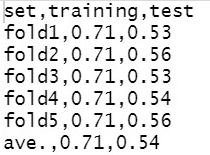
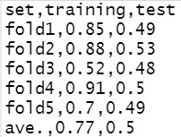

# 資料科學期末報告

組員：

資科四    陳岳紘	106703003	
 
資科四    蔣翰宗	106703004
  
資科四    吳奇峰	106703024
 
資科四    劉煥澤	106703028
 
資科四    謝宇星	106703033

資科四    陳冠盛	106703052

## 資料說明

* 001_中文資料.csv：歌曲的raw data，包含歌名、歌詞、分類、作詞者、作曲者、發行年份與收藏頻率。
* 002_w2vDim400_1215.csv：將歌詞透過word2vec進行word embedding取400維。
* 003_tfidf_0110.csv：將歌名透過word2vec進行word embedding取400維、歌詞透過tf-idf進行word embedding後透過svd降維至200，另有新增歌曲的情感分數(Valence, Arousal)2維。

## 分類目標

預測各歌曲種類，分別為：
  1) encourage
  2) love
  3) friend
  4) family

## Null Model

1) encourage：0.418
2) love：0.102
3) friend：0.104
4) family：0.375

猜機率最高之encourage

* How do you perform evaluation?
  * cross validation
  * accuracy

## 採用的方法

* SVM
* KNN

## 視覺化網頁

## 結果

SVM

| set   | training | test |
|-------|----------|------|
| fold1 | 0.71     | 0.53 |
| fold2 | 0.71     | 0.56 |
| fold3 | 0.71     | 0.53 |
| fold4 | 0.71     | 0.54 |
| fold5 | 0.71     | 0.56 |
| ave.  | 0.71     | 0.54 |

KNN

| set   | training | test |
|-------|----------|------|
| fold1 | 0.85     | 0.53 |
| fold2 | 0.88     | 0.56 |
| fold3 | 0.52     | 0.53 |
| fold4 | 0.91     | 0.54 |
| fold5 | 0.7      | 0.49 |
| ave.  | 0.77     | 0.5  |

## 總結

## 參考資料

* https://rpubs.com/skydome20/R-Note14-SVM-SVR
* https://mojim.com/
* https://www.xiami.com/

* Packages：
  + kknn
  + caret
  + e1071
